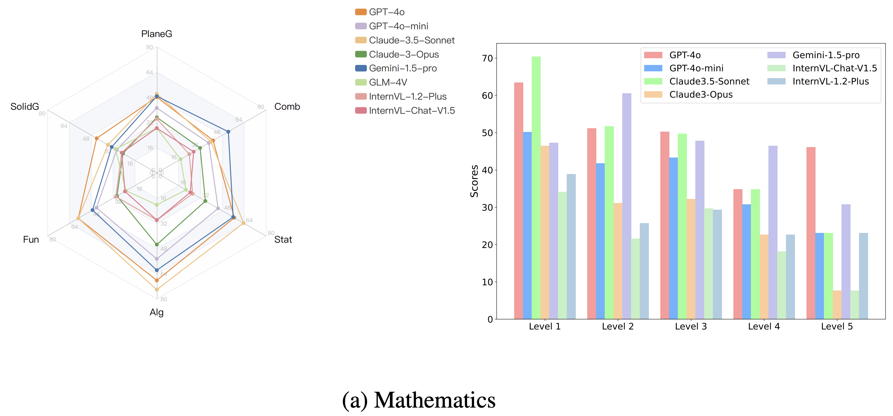
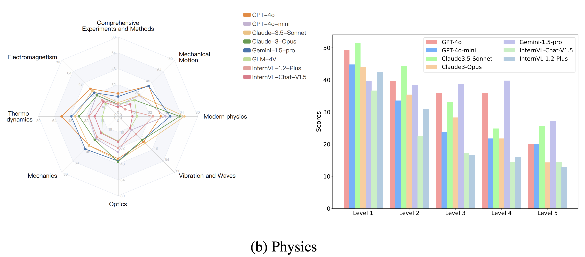
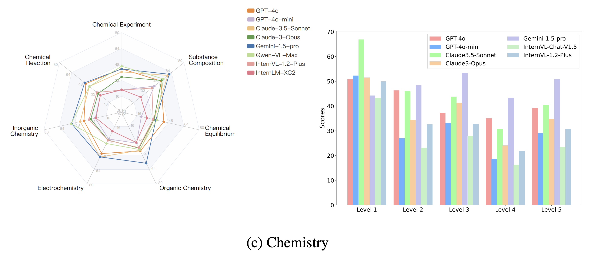

# VisScience
Official Pytorch Implementation for VisScience






We meticulously construct a comprehensive benchmark, named VisScience, which is utilized to assess the multi-modal scientific reasoning across the three disciplines of mathematics, physics, and chemistry. This benchmark comprises 3,000 questions drawn from K12 education — spanning elementary school through high school — equally distributed across three disciplines, with 1,000 questions per discipline. The questions within VisScience span 21 distinct subjects and are categorized into five difficulty levels, offering a broad spectrum of topics within each discipline.

If you want to find the detailed introduction, Read our paper: [VisScience: An Extensive Benchmark for Evaluating K12 Educational Multi-modal Scientific Reasoning](https://arxiv.org/pdf/2409.13730).


## Dataset Summary
### Mathematics


### Physics


### Chemistry


## Leaderboard


## Citation

If you find our work helpful, please consider citing the following papers

```
@article{jiang2024visscience,
  title={VisScience: An Extensive Benchmark for Evaluating K12 Educational Multi-modal Scientific Reasoning},
  author={Jiang, Zhihuan and Yang, Zhen and Chen, Jinhao and Du, Zhengxiao and Wang, Weihan and Xu, Bin and Dong, Yuxiao and Tang, Jie},
  journal={arXiv preprint arXiv:2409.13730},
  year={2024}
}
```
