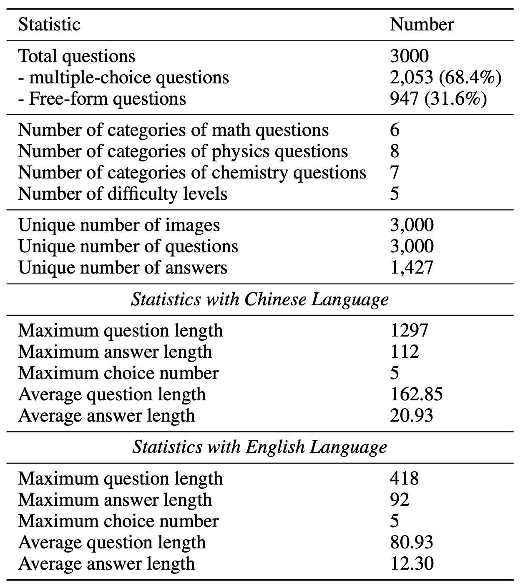
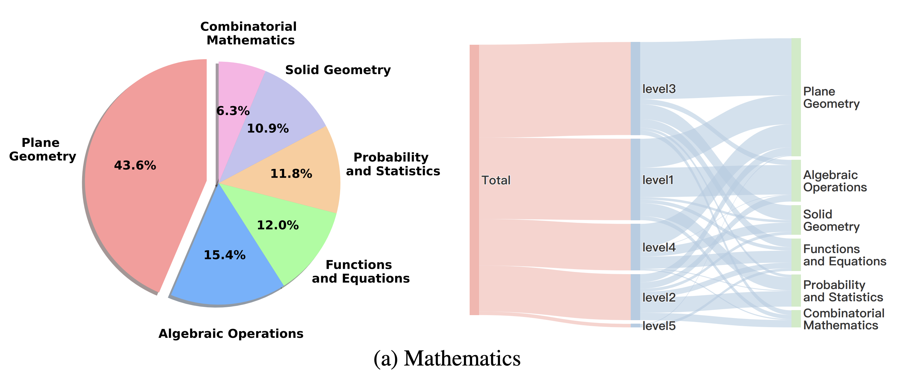
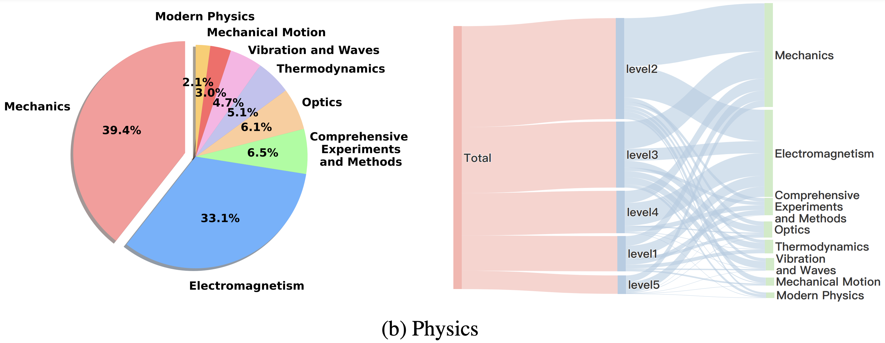
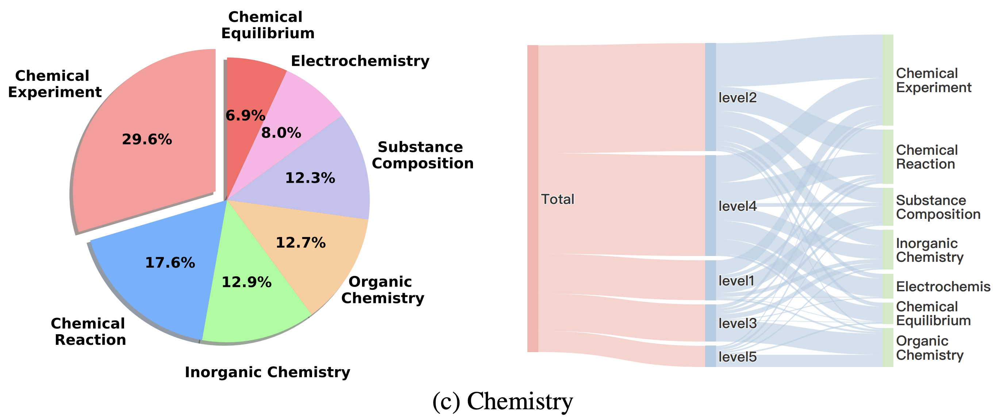

# VisScience
Official Pytorch Implementation for VisScience


We meticulously construct a comprehensive benchmark, named VisScience, which is utilized to assess the multi-modal scientific reasoning across the three disciplines of mathematics, physics, and chemistry. This benchmark comprises 3,000 questions drawn from K12 education — spanning elementary school through high school — equally distributed across three disciplines, with 1,000 questions per discipline. The questions within VisScience span 21 distinct subjects and are categorized into five difficulty levels, offering a broad spectrum of topics within each discipline.

If you want to find the detailed introduction, Read our paper: [VisScience: An Extensive Benchmark for Evaluating K12 Educational Multi-modal Scientific Reasoning](https://arxiv.org/pdf/2409.13730).


## Dataset Summary

The VisScience benchmark is a carefully curated dataset designed to evaluate the performance of multi-modal large language models (MLLMs) in scientific reasoning across multiple modalities. It specifically focuses on bilingual tasks involving both English and Chinese. The benchmark combines textual and visual inputs, covering three scientific disciplines: **mathematics**, **physics**, and **chemistry**. Each discipline contains 1,000 questions, carefully selected from various chapters to ensure broad and comprehensive coverage of topics and concepts.



### Mathematics
In mathematics, the dataset can be divided into six key areas: **plane geometry**, **solid geometry**, **functions and equations**, **algebraic operations**, **probability and statistics**, and **combinatorial mathematics**. 

### Physics
The physical component of the VisScience benchmark encompasses eight subjects, including **mechanics**, **thermodynamics**, **comprehensive experiments and methods**, **mechanical motion**, **vibration and waves**, **optics**, **electromagnetism**, and **modern physics**. 

### Chemistry
The chemistry section of the VisScience benchmark includes seven topics such as **chemical experiments**, **organic chemistry**, **substance composition**, **electrochemistry**, **chemical reactions**, **inorganic chemistry**, and **chemical equilibrium**. 



## Leaderboard


## Citation

If you find our work helpful, please consider citing the following papers

```
@article{jiang2024visscience,
  title={VisScience: An Extensive Benchmark for Evaluating K12 Educational Multi-modal Scientific Reasoning},
  author={Jiang, Zhihuan and Yang, Zhen and Chen, Jinhao and Du, Zhengxiao and Wang, Weihan and Xu, Bin and Dong, Yuxiao and Tang, Jie},
  journal={arXiv preprint arXiv:2409.13730},
  year={2024}
}
```
